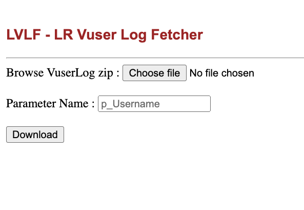

# LR-VuserLog-Fetcher


- Imagine you have a LoadRunner script which has n number of users and you want to check for which user it is failing
- Of course, you can run in vugen itself with n iterations to fetch that, but let me tell you one amazing way to fetch the same
- Clone this repository running below command
```
git clone https://github.com/shayansaha85/LR-VuserLog-Fetcher.git
```
- Install python from this link : [Python](https://www.python.org/downloads/)
- Our this code uses three libraries : **flask**, **re**, and **os**
- **re** and **os** will be pre-installed with Python
- For downloading **flask** run below command in your terminal
```
pip install flask
```
_**Note** : pip will be installed automatically when you will install Python_

## How to use it?
- Go to the cloned repository folder and run below command to run the application
```
python fetch-parameter.py
```
- Launch this URL in browser : **http://localhost:5000/home**
- Upload the zip file where you have all Vuser Log files
- Enter the parameter name you want to fetch
- Click on download and it will download a **output.csv** file with all filtered parameter values.

### Screenshot
